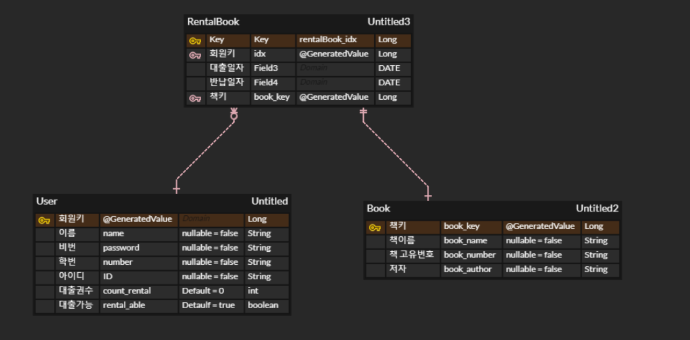

# 🍃 Activity-Book-Management

## 프로젝트 간단 소개
> 스프링부트를 이용하여 도서 관리 시스템 서버를 구축해보았습니다. :)

## 사용된 기술
- 자바 버전 : Java 11
- 컴파일러 : Gradle(2.5.2)
- IDE : Intellij IDEA
- 프레임 워크 : Spring Boot
- 데이터베이스 : H2 Database
- 사용된 기술 : Spring DataJPA, QueryDSL, Spring Security, Swagger, Lombok, Redis, Jwt etc..

# ERD

# 📜 구현 기능

## 💁‍♂️ 회원
- 회원가입
- 로그인
- 로그아웃
- 비밀번호 변경
- 대여한 책 조회

## 📕 책

- 책 추가
- 책 정보 수정
- 책 삭제
- 책 목록 조회
- 책 목록(카테고리별) 조회
- 책 목록(제목별) 조회

## 📚 책 대여 & 반납

- 대여 가능한 책 조회
- 책 대여
- 책 반납
- 책 연장
